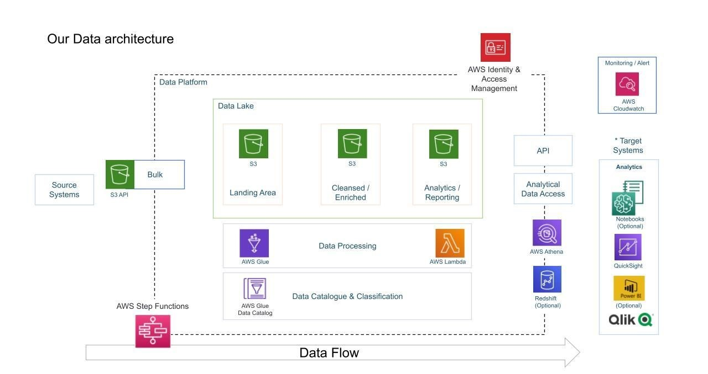

# 📊 Data Engineering YouTube Analysis Project

**Author**: Abdullah Anwer  
**Live Portfolio**: [abdullahwork.online](https://abdullahwork.online)

## 🔍 Overview
This project securely manages, transforms, and analyzes YouTube trending video data using AWS services in a scalable, serverless data pipeline.

## 🎯 Project Goals
- **Data Ingestion** from multiple raw sources (CSV, JSON)
- **ETL Process** with Lambda and Glue
- **Centralized Storage** using Amazon S3 as a Data Lake
- **Scalability** using serverless architecture
- **Cloud Deployment** using AWS
- **Reporting & Visualization** using QuickSight

## 🛠️ AWS Services Used
- **Amazon S3**: Object storage for raw and transformed data
- **AWS Lambda**: Parses JSON and triggers ETL
- **AWS Glue**: Performs data transformations and quality checks
- **AWS IAM**: Manages secure access
- **Amazon Athena**: SQL querying on S3 data
- **Amazon QuickSight**: Dashboard for insights

## 📁 Dataset
Source: [Kaggle YouTube Trending Data](https://www.kaggle.com/datasets/datasnaek/youtube-new)

## 🧱 Architecture Diagram

## 🧬 Lambda Function (JSON Ingestion)
[lambda/lambda_function.py](lambda/lambda_function.py)

## 🧪 AWS Glue Script (ETL + DQ)
[glue_jobs/youtube_glue_job.py](glue_jobs/youtube_glue_job.py)

## 🧾 CLI Upload Commands
Stored in [aws_cli_commands.md](aws_cli_commands.md)

## 📊 Reporting
Visual insights were generated using Amazon QuickSight. [Sample PDF](architecture/quicksight_dashboard.pdf)

## 🚀 How to Run
1. Upload CSVs to S3 using `aws s3 cp`
2. Trigger Lambda via S3 upload event
3. Glue Job performs transformations
4. Data written to S3 in Parquet format, queryable via Athena
5. Dashboard generation in QuickSight

## 📦 Future Improvements
- Automate pipeline using Step Functions
- Integrate real-time streaming data
- Expand dashboard filters & interactivity
